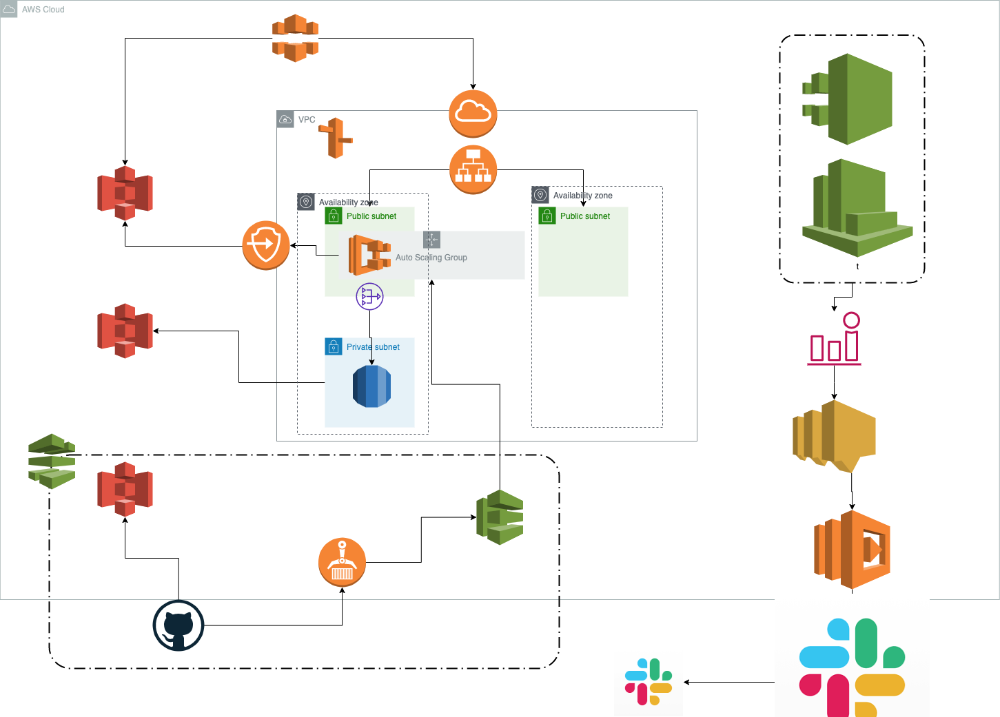

# 作成するAWSリソース
## メインサーバ
- vpc
- パブリックサブネット2つ
- プライベートサブネット１つ
- ルートテーブル
- ecsクラスター
- ecsサービス（ec2）1つ
- auto scaling groupの設定
- nat gateway
- application load balancer(L4)
- route53

- cloud front(任意)

## ストレージ
- ARS(amazon aurora)
- vpcエンドポイント
- s3(静的コンテンツ用)
- s3(dbバックアップ用)
- s3(ecrデプロイ用)

- redis cluster(任意)

## cdパイプライン
- ecrリポジトリ
- code deploy
- code pipeline

## 監視
- cloud trail
- cloud watch
- cloud watch alarm
- sns
- lambda

## terraform構成図（未実装）

